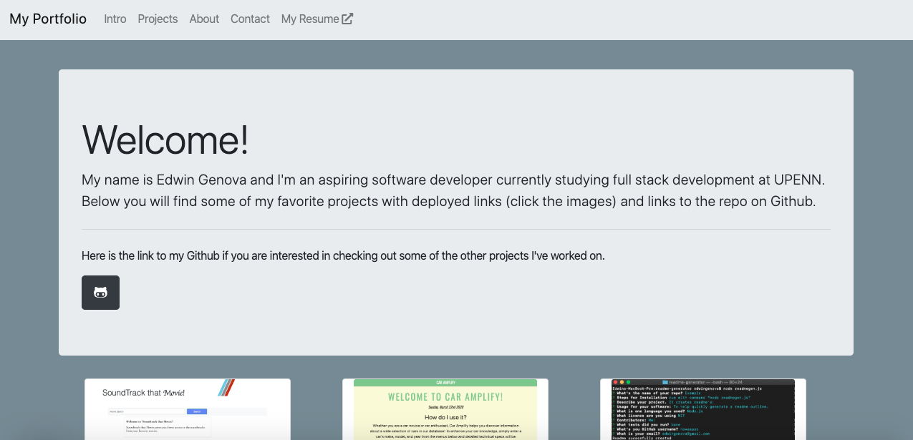

# My Portfolio
## Description: 
This is a very simple and easy to navigate website where you can checkout my projects, learn a bit about me and get in find my contact info.
## Table Of Contents:
* How To Install
* Usage
* Technology Used/Badges
* Contributors
* Tests
* GitHub
## How To Install: 
All you need is a web browser! Deployed Link: https://novaaaax.github.io/
## Usage:
Meant for anyone interested in checking out my work. 

## Technologies Used/Bagdes: 
   
## Lisence:  
MIT
## Contributors:
Edwin Genova
## Tests:
None
## GitHub: 

